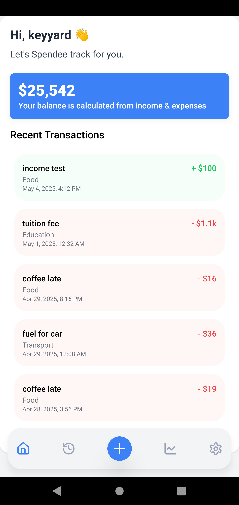
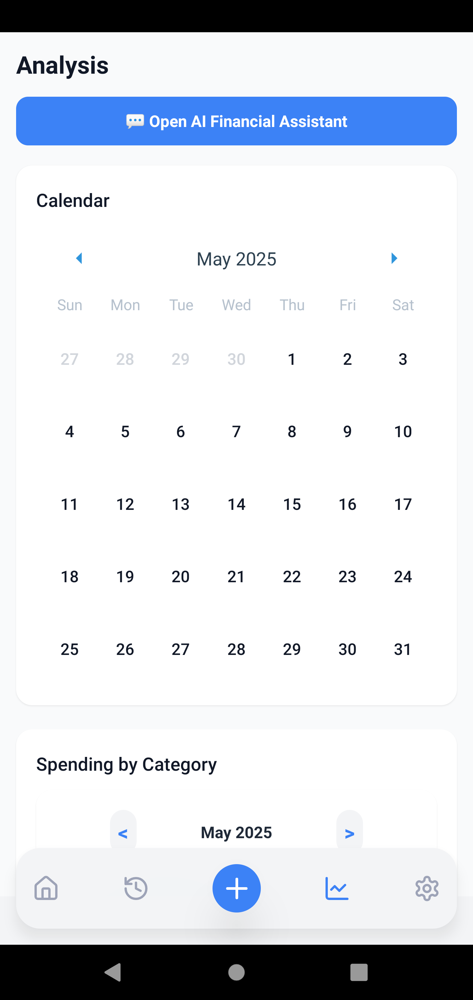
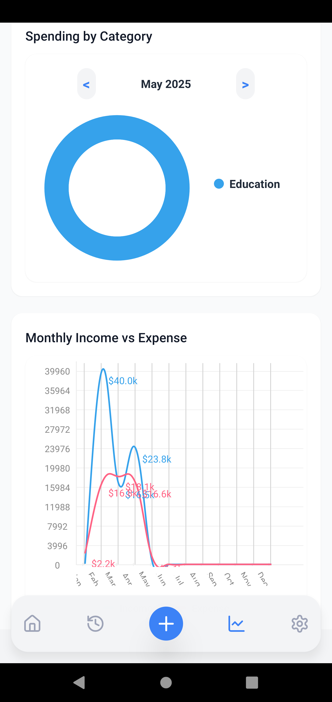
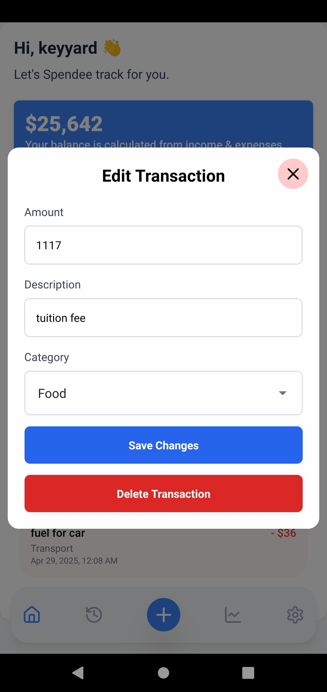
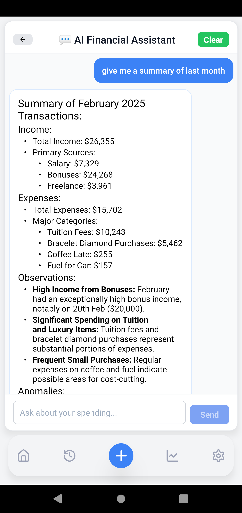

# Spendee

> Spend with Spendee for a better financial future!
> Assignment for School by Trinh Minh Hieu - Keyyard

<p align="center">
  <a href="https://reactnative.dev/">
    
  </a>
  <a href="https://fastapi.tiangolo.com/">
    
  </a>
  <a href="https://supabase.com/">
    
  </a>
  <a href="https://www.prisma.io/">
    
  </a>
  <a href="https://www.nativewind.dev/">
    
  </a>
  <a href="https://clerk.com/">
    
  </a>
  <a href="https://code.visualstudio.com/docs/editor/tasks">
    
  </a>
</p>

---

## 🌟 What Makes Spendee Different

Spendee stands out in the crowded personal finance market through its **conversational AI financial assistant** and **modern tech stack** that enables a seamless experience across mobile and web platforms.

### Key Differentiators

- **Natural Language Financial Insights** - Ask questions like "How much did I spend on food last month?" and get instant, tailored answers
- **Cross-Platform from Day One** - Built with Expo for iOS, Android, and web compatibility without separate codebases
- **Design System-Driven UI** - Consistent, atomic components styled with NativeWind (Tailwind for React Native)
- **Developer Experience** - Single command setup, intelligent VS Code tasks, and clear architectural patterns

---

## Table of Contents
- [Core Features](#-core-features)
- [Technology Stack](#️-technology-stack)
- [Architecture](#architecture)
- [Advanced Implementations](#✨-advanced-implementations)
- [Design Patterns](#design-patterns--best-practices)
- [Setup & Development](#setup--development)
- [Testing](#testing)
- [Folder Structure](#folder-structure)
- [Contributing](#-contributing)
- [License](#-license)

---

## 🔥 Core Features

- **Expense & Income Tracking** - Easy entry and categorization of transactions
- **Budgeting** - Real-time budget calculations and visualizations
- **Analytics** - Interactive pie charts, dual-line charts, and calendar views
- **AI Financial Assistant** - Natural language queries against your financial data
- **Category Management** - Custom expense categories tailored to your spending habits
- **Cross-Platform Access** - Use on any device with the same seamless experience
## 🛠️ Technology Stack

### Frontend
- **React Native (Expo)** - Cross-platform mobile development
- **NativeWind/Tailwind CSS** - Utility-first styling
- **Expo Router** - File-based navigation
- **Clerk** - Authentication and user management
- **React Context API** - State management
- **Jest** - Testing

### Backend
- **FastAPI** - High-performance, async REST API
- **Prisma ORM** - Type-safe database queries
- **OpenAI Integration** - Natural language processing for financial insights
- **Custom Middleware** - Authentication, rate limiting, CORS
- **Repository Pattern** - Structured data access layer
- **Pytest** - Testing

## Architecture
- **Atomic Design** - Components organized as atoms
- **Barrel Pattern** - Simplified imports for better organization
- **Provider Pattern** - Context Providers for user, transactions, categories, and currency
- **Type Safety** - Type checking with TypeScript and Pydantic schemas
- **Separation of Concerns** - Clear boundaries between UI, state, services, and API logic
- **Service Layer** - Business logic separated from UI components
- **Custom Hooks** - Reusable logic for API calls and state management
- **Singleton Pattern** - For shared instances across the application
- **Centralized Styling** - Using NativeWind for a consistent design system
- **Repository Pattern** - For data access and manipulation
- **Middleware** - For authentication, logging, and error handling

## Key Features
- **Authentication**: Clerk integration for secure, cross-platform auth.
- **Expense & Income Tracking**: CRUD for transactions and categories.
- **Budgeting**: Monthly budget calculations and visualizations.
- **Analytics**: Pie charts, dual-line charts, and calendar-based spending views.
- **AI Assistant**: Ask questions like "How much did I spend on food last month?" and get instant answers.
- **Mobile & Web**: Expo Router for navigation, responsive design, and web support.

## Setup & Development

### Prerequisites
- Node.js (for frontend)
- Python 3.8+ (for backend)
- npm
- pip

### 1. Clone the repository
```powershell
git clone https://github.com/keyyard/spendee.git
cd spendee
```
### 2. Install dependencies
- Run task: `Install All Dependencies` in VS Code or manually:
```powershell
cd frontend
npm install
cd ../backend
pip install -r requirements.txt
```
### 3. Environment Variables
- Create a `.env` file in the `backend` directory and add your OpenAI API key:
```plaintext
OPENAI_API_KEY=your_openai_api_key
```
- Create a `.env` file in the `frontend` directory and add your Clerk API keys:
```plaintext
CLERK_FRONTEND_API=your_clerk_frontend_api
CLERK_API_KEY=your_clerk_api_key
```
### 4. Run the application
- Run Task: `Dev` in VS Code or manually:
```powershell
cd frontend
npm start
```
```powershell
cd backend
uvicorn main:app --reload --host 0.0.0.0 --port 8000 --reload
```

## Testing
#### Frontend
- Run Task: `Frontend Test` in VS Code or manually:
```powershell
cd frontend
npm test
```
#### Backend
- Run Task: `Backend Test` in VS Code or manually:
```powershell
cd backend
pytest tests
```
## Strengths
- **Modern Architecture** - Clear separation of concerns, modular components
- **Developer Experience** - One-command setup, intelligent VS Code tasks
- **Cross-Platform** - Write once, run on iOS, Android, and web
- **AI-powered** - Natural language financial insights
- **Type Safety** - End-to-end type checking
- **Comprehensive Testing** - Automated tests for both frontend and backend

## Known Limitations
- **AI Assistant costs** - Requires OpenAI API key (potentially incurring costs)
- **No offline support** - Cloud-first approach requires network connectivity
- **Mobile/web parity** - Some features may have slight differences between platforms
- **Limited multi-user features** - Primarily designed for individual use
- **Not centralized Styling** - creating ``global.css`` classes with @apply for Tailwind classes is not rendering on Expo somehow, so i used direct styling, and styled components.

## 📱 Application Preview

<div align="center">
  <table>
    <tr>
      <td align="center"><b>Home</b></td>
      <td align="center"><b>Expense Analytics</b></td>
      <td align="center"><b>AI Assistant</b></td>
    </tr>
    <tr>
      <td></td>
      <td></td>
      <td></td>
    </tr>
    <tr>
      <td align="center"><b>Add Transaction</b></td>
      <td align="center"><b>Transaction Detail</b></td>
      <td align="center"><b>AI Assistant</b></td>
    </tr>
    <tr>
      <td></td>
      <td></td>
      <td></td>
    </tr>
  </table>
</div>

## 📋 Future Roadmap

- [ ] **Offline Mode**: Cache transactions locally and sync when online
- [ ] **Multi-Currency Support**: Handle expenses in different currencies
- [ ] **Subscription Tracking**: Monitor recurring payments and provide insights
- [ ] **Receipt Scanning**: Add OCR for automatic expense capture
- [ ] **Financial Goals**: Set and track savings objectives
- [ ] **Investment Tracking**: Integrate with investment APIs
- [ ] **Data Export**: Download transaction history in various formats

## 🤝 Contributing

Contributions are what make the open-source community an amazing place to learn, inspire, and create. Any contributions you make are **greatly appreciated**.
